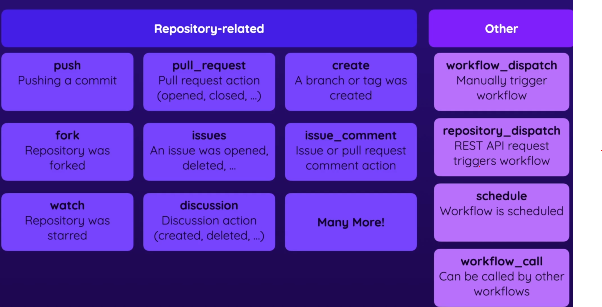

# I. 🐱‍💻📚 Git and GitHub Basics

## 🛠️💡Helper commands

### Basic 🛠️

```shell
>> git init # will initialize the project with git and its magic!
>> git add <file(s)> # will stage the changes for next commit
>> git commit -m <commit_message> # will commit the changes
>> git status # will show the status of the changes in git that are logged
>> git log # gives the chronologically ordered list of commits, and logs all commits older than the current commit we have checked out
>> git checkout <id> # This will be temporarily moving to a different commit
>> git revert <id> # This will revert the changes of the particular commit will be removed (not delete) - there is a new commit made to undo the commit changes
>> git reset --hard <id> # This will delete the data of the previous commits and will rewrite the history !!
```

### Branching 🌿

```shell
>> git branch <branch_name> # creates a new branch
>> git checkout -b <branch_name> # will create a new branch and checkout the same
>> git checkout <branch_name> # will switch to an existing branch specified. If there are uncommitted changes in the current change, Git will allow to switch only if uncommitted changes do not conflict with the branch you are switching to
>> git merge  <branch_name> # merges the changes from the branch back to main branch
>> git branch # lists the branches and the *<green_branch_name> will indicate the current branch you are working on
>> git branch -D <branch_name> # will delete the branch and the commits that are part of it
```

### Working with GitHub 🔧

```shell
>> git remote add <local_name> <remote_repo_url> # will add a remote repository like GitHub, usually local_name = origin
>> git remote set-url origin git@github.com:custom_username/repository.git # will change the URL or origin remote to the new SSH URL with custom username
>> git push  # will add the local commits to the remote repository
>> git push --set-upstream origin main # will set up tracking and push local commits to the remote repository branch named "main"
>> git pull # will pull the commits from the remote repository which are not present locally
>> git clone <url> <project_name> # will clone the project from the remote repository to the local machine
>> git remote get-url origin # command will output the URL associated with the specified remote repository
```

## 🤔💬 Q & A's

<details>
  
<summary><h3> What is the meaning of <code>HEAD->main</code> ? </h3></summary>

The `HEAD` is the reference to the currently checked-out branch or commit. `main` refers to the name of the branch. When you see `HEAD-main` it means that the `HEAD` pointer is currently pointing to the `main` branch. This typically occurs when you are on the `main` branch and have made changes or are viewing the history of commits on that branch. It is a way that Git indicates which branch you are currently working with or viewing. In Git, `main` is the default branch (instead of the `master`, which was more commonly used in the past).

</details>

<details>

<summary><h3> What is the difference between <code>rebase</code> and <code>merge</code> ? </h3></summary>

#### Merge

1. **Merge `feature` into `main`:**
   - With merge, you bring the changes from `feature` branch into `main` branch.
   - When you merge `feature` into `main`, Git creates a new commit on `main` that combines the changes from both branches.
   - This creates a merge commit that has two parent commits: one from `main` and one from `feature`.
   - This method preserves the commit history of both branches but adds a merge commit.

```sh
git checkout main
git merge feature
```

#### Rebase

1. **Rebase `feature` onto `main`:**
   - With rebase, you move the entire `feature` branch to begin from the tip of `main` branch.
   - Git rewinds the changes made in `feature`, switches to `main`, applies the changes from `main`, and then applies the changes from `feature` on top of it.
   - This results in a linear commit history without any merge commits.
   - It essentially replays the changes made in `feature` as if they were made directly on top of the latest `main` commit.

```sh
git checkout feature
git rebase main
```

#### Example

Let's say `main` has commits A, B, and C, and `feature` has commits X, Y, and Z. After merging and rebasing, the commit history might look like this:

##### Merge

```
              ┌─── Merge Commit (M) ─┐
             /                        \
main:  A ── B ── C ── M ─────────────────
                       \            /
feature:               X ── Y ── Z
```

##### Rebase

```
main:  A ── B ── C ─────────────────────────
                                 \
feature:                         X' ── Y' ── Z'
```

In the merge scenario, there's a merge commit (`M`) that integrates changes from both branches. In the rebase scenario, the commits from `feature` are applied directly on top of `main` without any additional merge commits.

#### Summary

- **Merge:** Integrates changes from one branch into another, creating a merge commit.
- **Rebase:** Moves the entire branch to begin from the tip of another branch, creating a linear commit history.

**Both approaches have their use cases. Merge is generally used for preserving context in a collaborative environment, while rebase is used for maintaining a clean and linear commit history.**

</details>

<details>

<summary><h3>What is the use of <code>git push --set-upstream origin main</code>?</h3></summary>

The command `git push --set-upstream origin main` is used to set up a tracking relationship between the local branch and the remote repository branch. Here's what it does:

1. **Push Changes to Remote Repository (`git push`):**
   - The `git push` command is used to upload local branch commits to a remote repository.

2. **Set Upstream Branch (`--set-upstream` or `-u`):**
   - The `--set-upstream` or `-u` option establishes a connection between the local branch and the corresponding branch on the remote repository.
   - This option sets the upstream branch for the current local branch, meaning that future `git push` and `git pull` commands will use this relationship by default.

3. **Specify Remote Repository (`origin`):**
   - `origin` is the name of the remote repository. It's a common default name for the remote repository that was cloned from or added as a remote.

4. **Specify Branch Name (`main`):**
   - `main` is the name of the branch on the remote repository where the changes will be pushed.

#### Use Case

- Suppose you've created a new branch locally and made some commits on it.
- When you try to push these changes using `git push`, Git will prompt you to specify the remote repository and branch to push to because it doesn't know where to push the changes.
- By using `git push --set-upstream origin main`, you're specifying that the local branch should track the `main` branch on the `origin` remote repository.
- After this setup, future `git push` commands on this branch will automatically push changes to the `main` branch on the `origin` repository without needing to specify the remote and branch every time.

In summary, `git push --set-upstream origin main` is used to establish a tracking relationship between a local branch and a branch on a remote repository, simplifying future push and pull operations.

</details>

# II. 🏗️ GitHub Actions - Basic Building Blocks

### Workflows, Jobs and Steps

- **Workflows** : They are attached to the GitHub repository. They contain one or more jobs. There are **events** which trigger the workflow
- **Jobs** : They define a **Runner** (an execution environment). They can be pre-defined or custom. There are steps which are executed in the runner environment. The jobs can run sequentially/parallely. They can also be driven by some condition.
- **Steps**: They execute a shell script or an action. They can be custom or third

The GitHub workflows are defined as files within the repository and will be part of the repo itself and commits within it.

### Events (Workflow Triggers)

There are tons of repository-related events, some include: `push`, `pull_request`, `create`, `fork`, `issues`, `issue_comment`, etc.
Also, we can control what kind of push should trigger the event. So, for example we can trigger the event when we perform a `push` to a particular branch.

### Actions

An Action is a separate feature from a workflow in the context of GitHub action. It is a (custom) application that performs a (typically complex) frequently repeated task. An alternative but a simple step is the `run` command in GitHub ction which could be a simple shell command that is defined by us. We can use our own custom action or community driven action.

The keyword that we use for running an **action** in the job of a workflow is that we use the `uses` keyword.

Also note when configuring the runner in a GitHub workflow, the application logic is run on the runner. The runner sets up the environment according to the job's requirement (specified in the `runs-on` field). The runner checks out the code (using actions like `actions/checkout`), sets up any related environment variables, and install necessary dependencies. The runner then executes each step defined in the job. Steps can run shell commands directly or use pre-built actions from the GitHub marketplace.

### Jobs

A job is a set of steps that execute on the same runner. Jobs allow you to define stages of your workflow, such as build, test, deploy. Every job has its own runner - its own VM that is totally isolated from other machines and jobs. Jobs within the same workflow can run independently and concurrently unless you specify dependencies between them.

The unique identifiers for the job in GitHub Actions workflow are not built-in keywords; they are arbitrary names that you define to reference each job within the workflow. You choose the identifiers for the jobs. They should be unique within the workflow file. There are no predefined job identifiers like `build`, `test` and `deploy` in GitHub Actions.

### Naming jobs (best practice)

- **Descriptive names:** Use descriptive names for job identifiers to make your workflow easier to understand. E.g. `build_stage` instead of `build`
- **Consistency:** Maintain consistent naming conventions throughout your workflows to improve readability and maintainability.
- **Avoid Special characters:** Stick to alphanumeric characters and underscores (_) for job identifiers to avoid potential issues.

### Expressions

They are used to compute values dynamically within the workflow YAML. They can be used in `if` conditionals, environment variables, and other fields that support dynamic values.

#### Basic Syntax

Expressions are enclosed within `${{  }}`. For example:

```yml
name: CI

on: [push]

jobs:
  example-job:
    runs-on: ubuntu-latest

    steps:
      - name: Print message
        run: echo "Hello, ${{ github.actor }}"

```

In this example, we have `%{{ github.actor }}` which evaluates to the username of the person who triggered the workflow.

**Common operators:**

- Logical Operators: &&, ||, !
- Comparison Operators: ==, !=, <, <=, >, >=
- Arithmetic Operators: +, -, *, /, %
- String Operators: startsWith, endsWith, contains

##### Example with `if` conditional

```yml
jobs:
  example-job:
    runs-on: ubuntu-latest

    steps:
      - name: Checkout code
        uses: actions/checkout@v2

      - name: Run tests
        if: ${{ github.event_name == 'push' && github.ref == 'refs/heads/main' }}
        run: npm test
```

This exaample runs the tests only if the workflow is triggered by a push event to the main branch.

### Contexts

Context provide access to the information about workflow runs, runner environment, jobs and steps. They are available in expressions and can be used to make decisions or pass data between jobs.

**Common Contexts**

1. `github` Context: Contains information aobut the workflow run & the event that triggered it. e.g. `github.actor`
2. `env` Context: Contains the env variable that have been set in the workflow. e.g. `env.<VARIABLE_NAME>`
3. `job` Context: Contains the info about the currently running job. e.g. `job.status`
4. `steps` Context: Contains the result of the previous steps in the current job. e.g. `steps.<step_id>.outputs`
5. `runner` Context: Contains the info about the runner executing the job. e.g. `runner.os`, `runner.arch`

##### Example with Contexts

```yml
name: CI

on: [push]

jobs:
  example-job:
    runs-on: ubuntu-latest

    steps:
      - name: Set up Node.js
        uses: actions/setup-node@v2
        with:
          node-version: '14'

      - name: Check out the code
        uses: actions/checkout@v2

      - name: Run tests
        run: npm test

      - name: Print GitHub Context
        run: echo "This workflow was triggered by ${{ github.actor }} on branch ${{ github.ref }} using commit ${{ github.sha }}"

      - name: Conditional Step
        if: ${{ runner.os == 'Linux' }}
        run: echo "This step runs only on Linux runners"
```

##### Combining Expressions and Contexts

```yml
name: CI

on: [push]

jobs:
  example-job:
    runs-on: ubuntu-latest

    steps:
      - name: Check out the code
        uses: actions/checkout@v2

      - name: Set environment variable
        run: echo "COMMIT_SHA=${{ github.sha }}" >> $GITHUB_ENV

      - name: Use environment variable
        run: echo "The commit SHA is ${{ env.COMMIT_SHA }}"
```

In this example, the `COMMIT_SHA` environment variable is set dynamically using the `github.sha` context and then used in a subsequent step.

##### Summary of Expressions & Contexts

- **Expressions**: Used to compute values dynamically within the workflow. Enclosed within `${{ }}` and support various operators.
- **Contexts**: Provide access to detailed information about the workflow, runner, jobs, and steps. Used within expressions to make workflows dynamic and responsive to runtime data.

## 🤔💬 Q & A's

<details><summary><h3>How can we set the jobs in a workflow to run in sequence / parallel?</h3></summary>

  In GitHub Actions, jobs run in parallel by default. However, you can control the execution order of jobs and run them sequentially by specifying job dependencies using the `needs` keyword. By setting up the dependencies, you ensure that a job will only run after the job it depends on is completed successfully.

### Example Workflow with Sequential Jobs

Here’s an example of how to set up a workflow with three jobs (`build`, `test`, and `deploy`) that run sequentially:

```yaml
name: CI Pipeline

on: [push, pull_request]

jobs:
  build:
    runs-on: ubuntu-latest

    steps:
    - name: Checkout code
      uses: actions/checkout@v2

    - name: Set up Node.js
      uses: actions/setup-node@v2
      with:
        node-version: '14'

    - name: Install dependencies
      run: npm install

    - name: Build project
      run: npm run build

  test:
    runs-on: ubuntu-latest
    needs: build

    steps:
    - name: Checkout code
      uses: actions/checkout@v2

    - name: Set up Node.js
      uses: actions/setup-node@v2
      with:
        node-version: '14'

    - name: Install dependencies
      run: npm install

    - name: Run tests
      run: npm test

  deploy:
    runs-on: ubuntu-latest
    needs: test

    steps:
    - name: Checkout code
      uses: actions/checkout@v2

    - name: Deploy to server
      run: ./deploy.sh
```

### Explanation

1. **Job Definitions:**
   - **`build` job:** This job checks out the code, sets up Node.js, installs dependencies, and builds the project.
   - **`test` job:** This job checks out the code, sets up Node.js, installs dependencies, and runs tests. It will only run after the `build` job completes successfully.
   - **`deploy` job:** This job checks out the code and deploys the project. It will only run after the `test` job completes successfully.

2. **Dependencies:**
   - The `needs: build` keyword in the `test` job specifies that the `test` job should run after the `build` job.
   - The `needs: test` keyword in the `deploy` job specifies that the `deploy` job should run after the `test` job.

### Using `needs` for Sequential Execution

- **Defining Dependencies:** Use the `needs` keyword to define which job(s) a job depends on. This ensures that jobs run in the specified order.
- **Sequential Execution:** By chaining dependencies, you can create a sequence of jobs that run one after another.

### Example with More Complex Dependencies

If you have a more complex workflow where multiple jobs need to run sequentially but some jobs can run in parallel within a sequence, you can set up a more complex dependency structure.

```yaml
name: Complex CI Pipeline

on: [push, pull_request]

jobs:
  setup:
    runs-on: ubuntu-latest

    steps:
    - name: Checkout code
      uses: actions/checkout@v2

    - name: Set up environment
      run: ./setup-env.sh

  build:
    runs-on: ubuntu-latest
    needs: setup

    steps:
    - name: Build project
      run: ./build.sh

  lint:
    runs-on: ubuntu-latest
    needs: setup

    steps:
    - name: Run linter
      run: npm run lint

  test:
    runs-on: ubuntu-latest
    needs: [build, lint]

    steps:
    - name: Run tests
      run: npm test

  deploy:
    runs-on: ubuntu-latest
    needs: test

    steps:
    - name: Deploy
      run: ./deploy.sh
```

### Explanation of Complex Example

1. **`setup` job:** This job prepares the environment.
2. **`build` and `lint` jobs:** These jobs both depend on the `setup` job and will run in parallel after `setup` completes.
3. **`test` job:** This job depends on both `build` and `lint` jobs, ensuring that tests are run only after both build and linting are done. Hence, multiple jobs can be placed in a list for the `needs` element.
4. **`deploy` job:** This job depends on the `test` job, ensuring that deployment happens only after tests pass.

### Summary

- **Parallel by Default:** Jobs run in parallel unless dependencies are specified.
- **Sequential Execution:** Use the `needs` keyword to specify dependencies and control the execution order.
- **Complex Workflows:** Combine multiple dependencies to create complex workflows with parallel and sequential job execution.

By defining dependencies using the `needs` keyword, you can control the order in which jobs run in your GitHub Actions workflow, ensuring they execute sequentially as required.

</details>

# III. 🔍 Workflows & Events - Deep Dive 🌊

There are many kinds of events which are repository-related and custom event-related.



### Event Filtering

Consider this YAML file:

```yaml
name: Events Demo 1
on:
  push:
    paths:
      - 'Code/03 Events/01 Starting Project/**'
  workflow_dispatch:
jobs:
  deploy:
    runs-on: ubuntu-latest
    steps:
      - name: Output event data
        run: echo "${{ toJSON(github.event) }}"
      - name: Get code
        uses: actions/checkout@v3
      - name: Install dependencies
        run: npm ci
      - name: Test code
        run: npm run test
      - name: Build code
        run: npm run build
      - name: Deploy project
        run: echo "Deploying..."
```

Here we have the `push` & `workflow_dispatch` event triggers activated on the custom path `Code/03 Events/01 Starting Project/**` but not always we want to run the `Deploy Project` step, we would only want to do that during the push to the main branch. In cases like that we can add an event filter. We can add an `if` conditional to the `Deploy Project` step like so:

- `github.ref == 'ref/heads/main'` : Checks if the reference (branch) being pushed to is the main branch
- `github.event_name == 'push'`: Ensures that the event triggering the workflow is a push event.

A workflow event in GitHub Actions can have multiple activity types associated with it. For example, the `pull_request` event can include activities such as `opened`, `assigned`, `closed`, `reopened`, etc. You can configure the workflow to be triggered or run only when a specific activity type occurs within the event, allowing you to precisely control when your workflow should execute based on the specific action that occurred.

### Skipping Workflow Runs

We can skip the workflow runs triggered by the `push` and `pull_request` events by including a command in the commit message.

Workflows that would otherwise be triggered using `on: push` or `on: pull_request` won't be triggered if you add any of the following strings to the commit message in a push, or the HEAD commit of a pull request:

- `[skip ci]`
- `[ci skip]`
- `[no ci]`
- `[skip actions]`
- `[actions skip]`

To leave the commit message exactly as you entered it, use the `--clean=verbatim` option on your commit.

The skip-checks trailer in a commit message is a convention used to instruct continuous integration (CI) systems, like GitHub Actions, to skip certain checks or workflows for that particular commit. This can be useful in situations where you want to bypass CI checks for a commit that doesn't need them, such as a minor documentation change or a temporary experiment.

#### Example 1 : Simple Commit message with `skip-checks: true` 

```txt
Fix typo in README

This commit corrects a small typo in the documentation.

skip-checks: true
```

#### Example 2 : Commit message with multiple trailers

```txt
Update dependencies and fix security vulnerabilities

This commit updates several dependencies to their latest versions
and addresses security vulnerabilities reported by Dependabot.

Signed-off-by: John Doe <john.doe@example.com>

skip-checks: true
```

## 🤔💬 Q & A's

<details><summary><h3>What are activity types and event filters in a GitHub Workflow?</h3></summary>

The "activity types" and "event filters" are concepts used to control the workflow and how should it be triggered or run based on specific aactions or conditions within an event.

### Activity Types

They refer to a specific action or event that can occur with a broader event type. For example:

- For the `pull_request` event, activity types include `opened`, `closed`, `synchronize`, `reopened` etc.
- For the `issues` event, activity types include `opened`, `edited`, `closed`, `assigned`, `labelled` etc.

Each activity type represents a specific action or change within the context of the event. You can configure your workflow to respond to specific activity types within an event by specifying them in the workflow YAML file.

### Event Filters

Event filters are conditions or criteria that you can use to control when the workflow should be triggered or run based on specific properties of the event. Common event filters include:

- Branch name: Trigger the workflow only when the changes are pushed to a specific branch (e.g. `main`, `develop`).
- Paths: Trigger the workflow only when the changes are made to files matching a specific path or pattern.
- Pull request actions: Trigger the workflow only when certain actions are performed on a pull request. (e.g. `opened`, `closed`, `synchronize`).

Event filters allow you to fine-tune when your workflow should execute based on the context of the event. You can use event filters to ensure that your workflow runs only when certain conditions are met, such as specific branches are affected or specific files are modified.

### Example

```yaml
name: Example Workflow

on:
  push:
    branches:
      - main
      - 'dev-*' # all branches which start with the word dev-
    paths:
      - 'src/**'
    paths-ignore:
      - '.github/workflows/*'
  pull_request:
    types: [opened, synchronize]

jobs:
  build:
    runs-on: ubuntu-latest
    steps:
      - name: Checkout code
        uses: actions/checkout@v2
      - name: Build project
        run: npm run build
```

In this workflow,

- The workflow will run on push events only when changes are pushed to the `main` branch & `dev-*` like branches and affect files in the `src` directory.
- The workflow will also run on `pull_request` events when pull requests are opened or synchronized.

</details>

<details>
<summary><h3>What is the default behaviour for an action that might be validily triggered by a forked repository?</h3></summary>

By default, Pull requests based on forks **DO NOT** trigger a workflow.

We can have our workflow configured such that it takes into account the restrictoins when dealing with forked repositories:

```yaml
name: Example Workflow

on:
  pull_request:
    types: [opened, synchronize]

jobs:
  build:
    runs-on: ubuntu-latest
    permissions:
      contents: read  # Restrict permissions to read-only
    steps:
      - name: Checkout code
        uses: actions/checkout@v2
        with:
          fetch-depth: 0  # Ensure full history is fetched for accurate diffs

      - name: Set up Node.js
        uses: actions/setup-node@v2
        with:
          node-version: '14'

      - name: Install dependencies
        run: npm ci

      - name: Run tests
        run: npm test

      - name: Conditional Deployment
        if: github.event.pull_request.head.repo.full_name == github.repository
        run: echo "Deploying..."
        # Add your deployment script here, but it will only run for pull requests from the same repository
```

- **Conditional Steps** - The `Conditional Deployment` step includes a conditional check to ensure that the deployments only occur for pull requests originating from the same repository (`github.event.pull_request.head.repo.full_name == github.repository`). This prevents the deployment job to be triggered from the forked repos.
- **Fetching full history** - The `fetch-depth : 0` option in the `actions/checkout` step ensures that the full history is fetched, which is useful for calculating the accurate diffs and understanding the full context of changes.
- **Read-only permissions** - The `permissions` key is set to read-only for contents to limit the scope of what the `GITHUB_TOKEN` can do, providing an additional layer of security.

</details>
